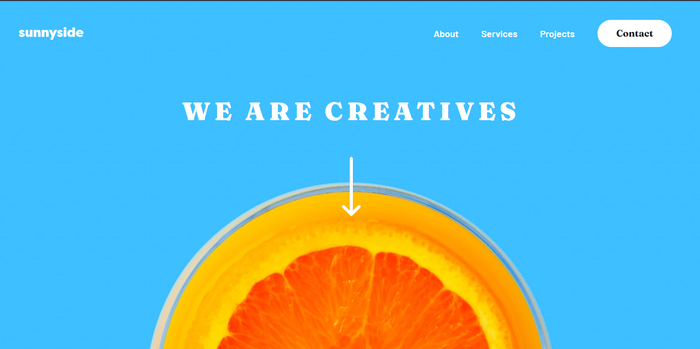
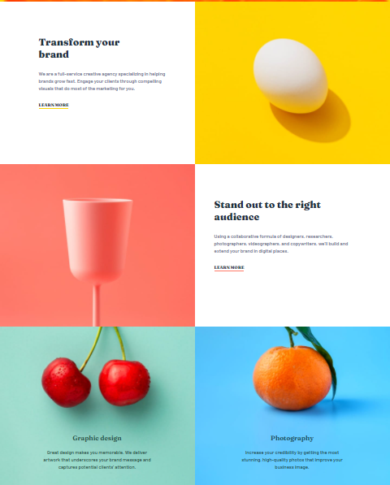

# Frontend Mentor - Sunnyside agency landing page

## Welcome! 👋

### The challenge

Users should be able to:

- View the optimal layout for the site depending on their device's screen size
- See hover states for all interactive elements on the page

### Screenshot

### Links

- Solution URL: [http://devendrapatidar.me/sunnyside-agency-landing-page/](http://devendrapatidar.me/sunnyside-agency-landing-page/)

### Built with

- Semantic HTML5 markup
- CSS custom properties
- CSS Grid